# Firekart

 
     

An Ecommerce application built in Flutter using Nodejs and MySQl.

## Getting started

* Project setup instructions are given at [Wiki](https://github.com/ashishrawat2911/firekart/wiki/Gettings-Started)
  section.

## Firekart Backend  ⚙️🗄️👨‍💻

* Firekart Backend is built with Nodejs and MySQl. Check [here](https://github.com/ashishrawat2911/firekart-backend).

# Screenshots

Splash Screen              |  Login Page               | OTP Page               |  Home Page
:-------------------------:|:-------------------------:|:-------------------------:|:-------------------------:
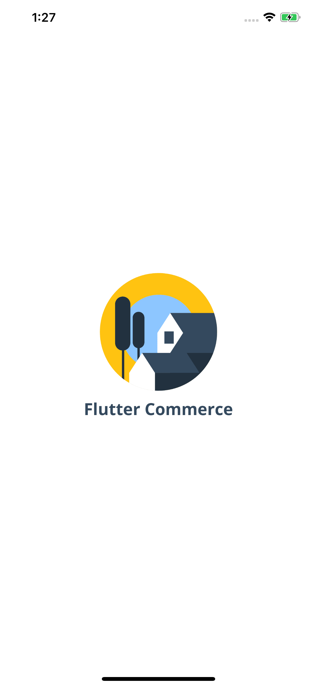|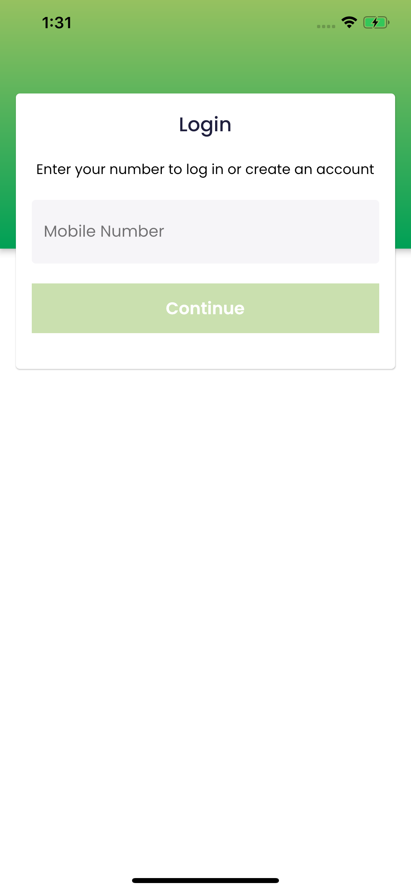|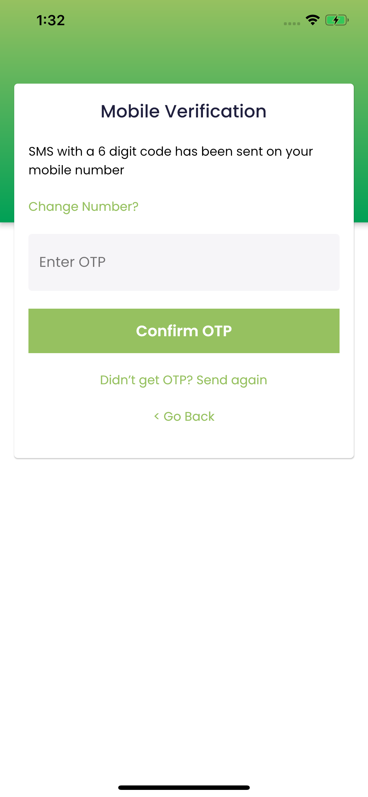|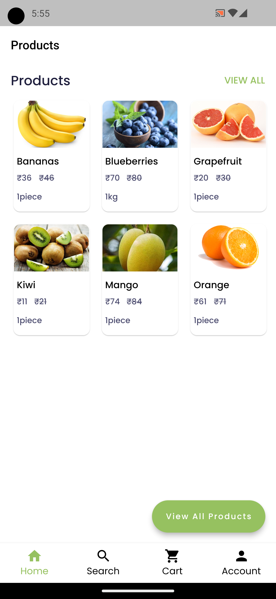|

Search Screen        |  Cart Screen       |   Address Screen               |  Add Address Screen
:-------------------------:|:-------------------------:|:-------------------------:|:-------------------------:
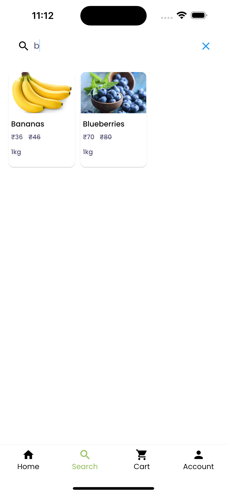|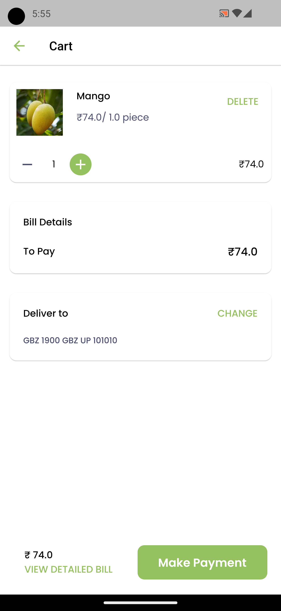|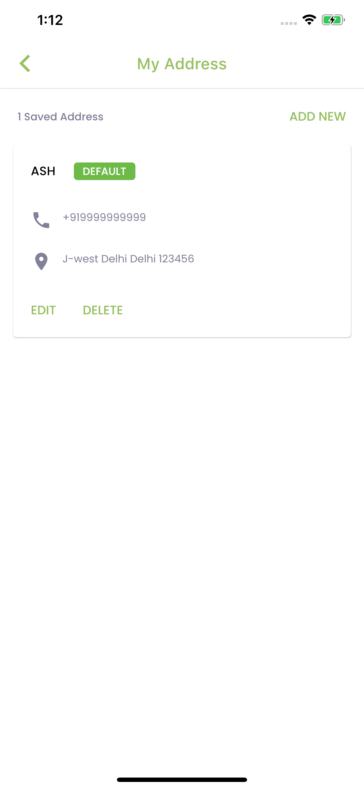|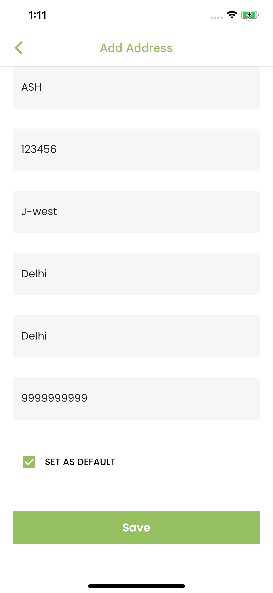|

Account Screen                  | Edit Details Screen       |   Orders Screen      |     Payment Screen
:-------------------------:|:-------------------------:|:-------------------------:|:-------------------------:
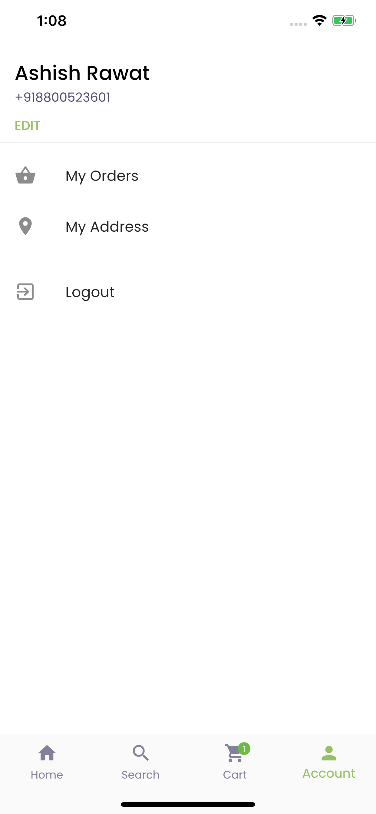|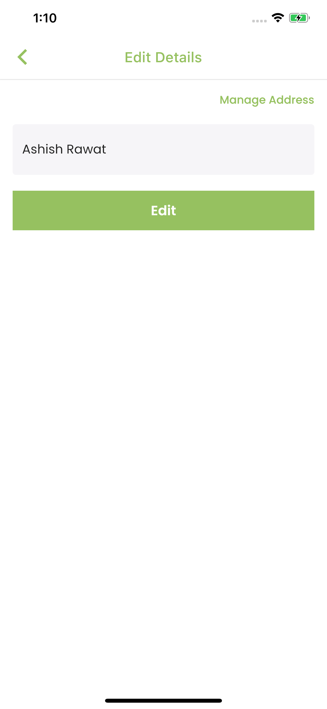|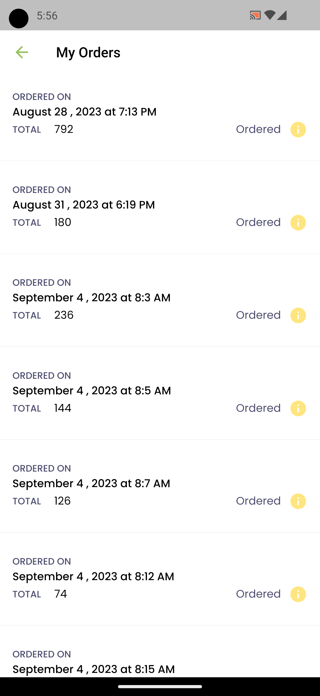|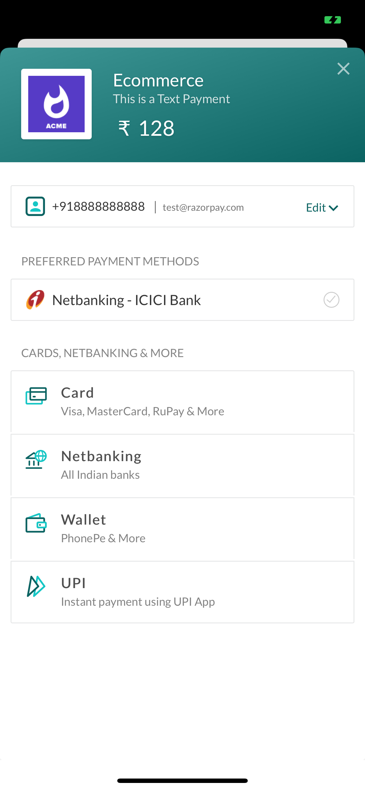|

Product Screen 1          |  Product Screen 2              |  Product Screen 3              
:---------------------------------:|:-------------------------:|:-------------------------:
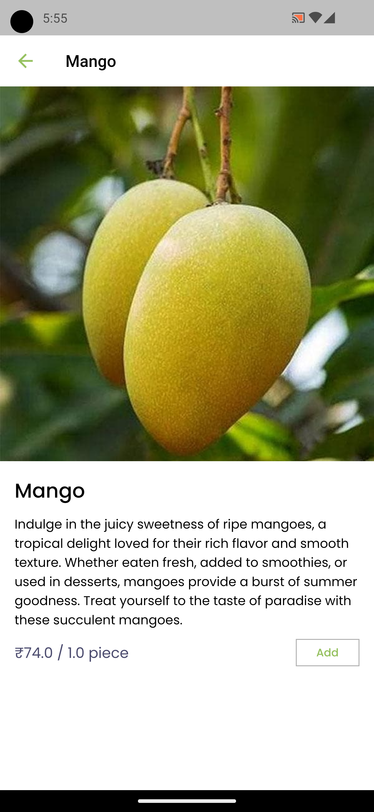 |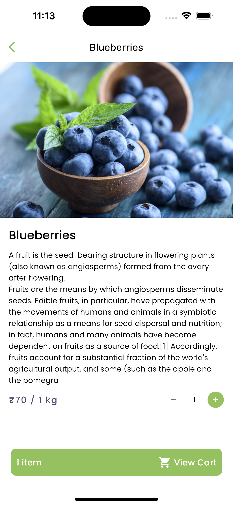|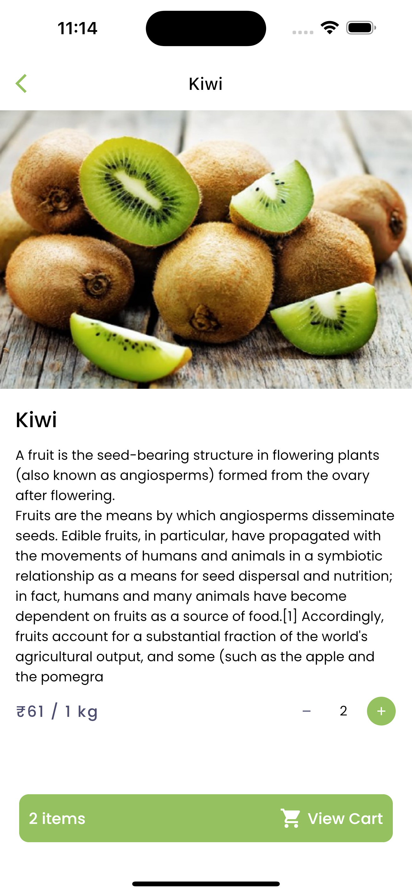

## Created & Maintained By

[Ashish Rawat](https://ashishrawat.dev) ([Twitter](https://www.twitter.com/ashishrawat2911))  ([Insta](https://www.instagram.com/ashishrawat2911)) ([Dev.to](https://dev.to/ashishrawat2911))

> If you found this project helpful or you learned something from the source code and want to thank me, consider buying
> me a cup of :coffee:
>
> * [PayPal](https://paypal.me/ashishrawat2911/)
